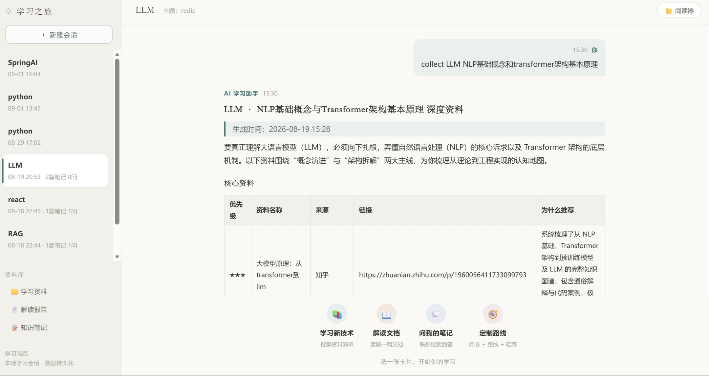
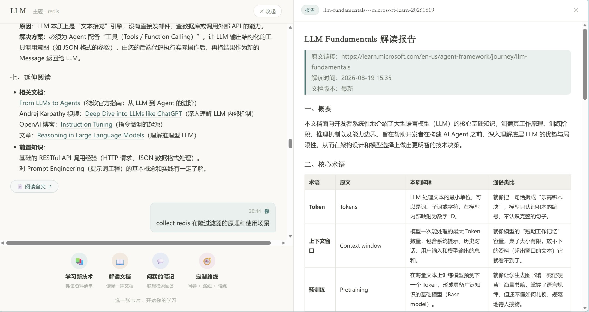
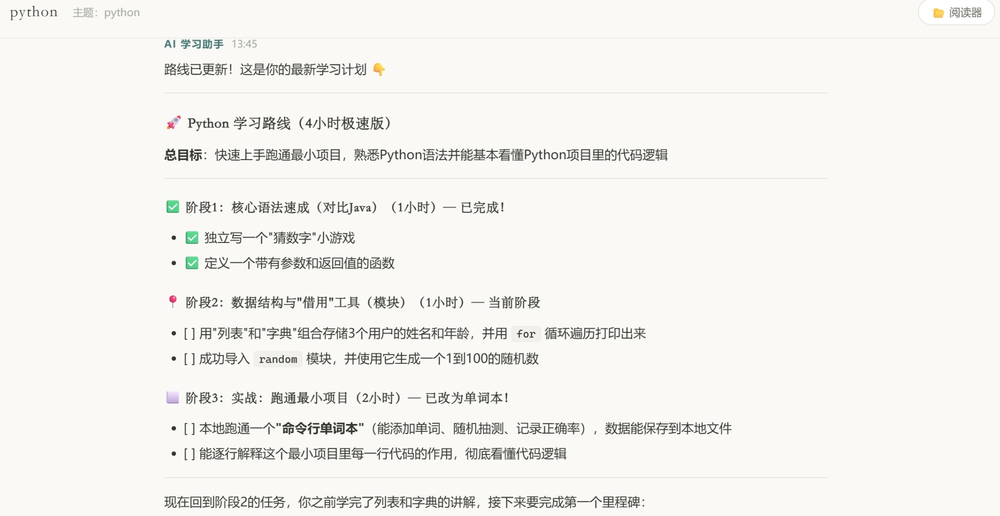
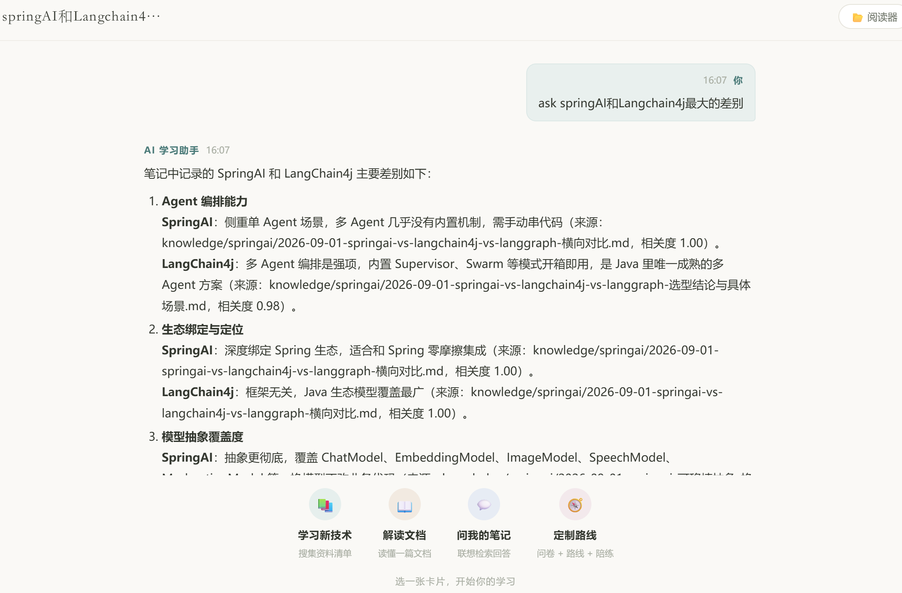
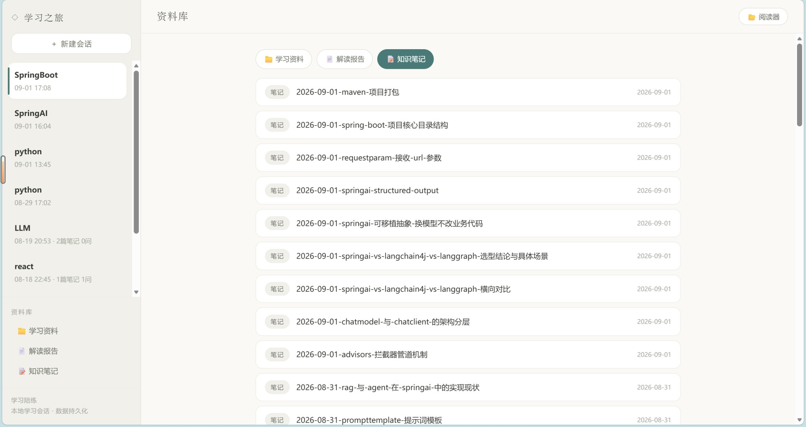

# Tech Learner Agent

[](./LICENSE)
[](./pyproject.toml)
[](https://github.com/cxydegit/tech-learner-agent/actions/workflows/ci.yml)

> 技术学习陪练 Agent：收集资料 → 解读文档 → 沉淀笔记 → 问我的笔记，再由一个具备记忆、工具调用能力的Coach Agent 完成定制化学习路线与陪练的完整学习闭环。


## 特性

- 🧭 **Coach Agent（route）**——项目核心：问卷摸清你的水平 → 生成分阶段可检验的学习路线 → 进入陪练模式，全程对话驱动，自主调用工具推进学习

- 📚 **Collect**——资料收集：搜索去重 + 并发抓取 + 质量预筛（官方域名 / GitHub 星数分级加分），生成结构化学习清单

- 📖 **Read**——文档解读：抓取 → 技术文档分类 → LLM 结构化解读报告，读过的文档自动复用

- 📝 **Note**——知识沉淀：差量提取新知识点，与已有笔记语义比对，自动入库或交你确认合并

- 💬 **Ask**——问自己的笔记：跨笔记联想检索（dense + BM25 混合），答案内联标注来源

- 🧠 **记忆系统**——学习内容自动写入、确定性检索注入回答、冲突解决、三舱摘要自我整理、跨会话恢复

- 🛡️ **工程化护栏**——工具调用预算、图级递归上限、纯文本降级、可恢复会话（LangGraph checkpointer）

***

## 目录

- [项目概述](#项目概述)

- [快速开始](#快速开始)

- [四个基础能力](#四个基础能力)

- [Coach Agent](#coach-agent)

- [记忆系统](#记忆系统)

- [Web 界面](#web-界面)

- [项目结构](#项目结构)

- [配置](#配置)

- [测试](#测试)

- [技术栈](#技术栈)

***

## 项目概述

开发者学习新技术时，通常面临以下问题：

- 资料分散、筛选成本高，需要跨平台手动搜集
- 官方文档以英文为主，术语抽象、缺乏上下文，阅读门槛高
- 学习路线不清晰，不知道该先学什么后学什么，容易迷失方向
- 知识点碎片化，缺乏体系化的整理和沉淀机制
- 与 LLM 对话获得的答案往往“一次即弃”，无法形成长期可复用的知识资产

本项目旨在构建一个 具备“资料获取、文档解读、知识沉淀、定制化学习路线”完整闭环的智能学习陪练 Agent，帮助开发者高效、系统地掌握一门新技术或框架。

**角色分工**：`collect` / `read` / `note` / `ask` 是四个**确定性、可独立使用**的基础能力；`route`（Coach Agent）是项目的**编排中枢**，它像一位真正的教练——先了解你（问卷），再为你定制学习路线（规划），然后陪你一步步执行（陪练），并在过程中把 `collect`、`read`、`ask` 作为自己的工具来调度，同时通过记忆系统持续读写你的知识库。


## 快速开始

### 1. 安装

需要 **Python 3.11+**。

```bash
# 克隆与安装（自动装齐所有依赖）
git clone https://github.com/cxydegit/tech-learner-agent
cd tech-learner-agent
pip install -e .    # editable 安装（本地改代码即时生效）；正式使用可 pip install .
```

安装后会自动创建两个命令：

| 命令                 | 作用                                                 |
| ------------------ | -------------------------------------------------- |
| `tech-learner`     | CLI（`collect` / `read` / `note` / `ask` / `route`） |
| `tech-learner-web` | 启动 Web 界面（默认 http://127.0.0.1:8000）              |

> 旧 `requirements.txt` 已被 `pyproject.toml` 取代；自定义依赖请加在 `pyproject.toml` 的 `[project].dependencies` 里。

> 需要跑测试 / 本地 lint（`pytest`、`ruff`）时，改装 `pip install -e ".[dev]"`——测试工具链与 CI 在 `pyproject.toml` 的 `[project.optional-dependencies].dev` 里同一处声明，避免"本地与 CI 用不同工具链"。

### 2. 配置 API Keys

```bash
cp .env.example .env
```

编辑 `.env` 填入：

| 变量                  | 来源                                                    | 说明                                                  |
| ------------------- | ----------------------------------------------------- | --------------------------------------------------- |
| `OPENAI_API_KEY`    | 你的 OpenAI 兼容服务商（默认[阿里云百炼](https://bailian.console.aliyun.com)） | LLM API Key——`OPENAI_BASE_URL` 指向谁就填谁的 key             |
| `OPENAI_BASE_URL`   | 默认百炼，可换任意兼容服务（见下）                                      | 默认 `https://dashscope.aliyuncs.com/compatible-mode/v1`；chat 走 OpenAI 兼容协议，整组变量切到 OpenAI 官方 / DeepSeek / Ollama 等即可换服务 |
| `MODEL_NAME`        | 你所选服务控制台                                            | 大模型名（默认例 `glm-5`；随 `OPENAI_BASE_URL` 切换同步改）          |
| `TAVILY_API_KEY`    | [tavily.com](https://tavily.com)                      | 网页搜索                                                |
| `FIRECRAWL_API_KEY` | [firecrawl.dev](https://firecrawl.dev)                | 网页抓取                                                |
| `GITHUB_TOKEN`      | [GitHub Settings](https://github.com/settings/tokens) | **可选**，collect 质量预筛查星数用，不填自动跳过                      |

> **切换 LLM 服务商（可选）**：本项目 LLM 调用统一走 **OpenAI 兼容协议**，默认指向百炼、不绑定百炼——想用 OpenAI 官方 / DeepSeek / 硅基流动 / 本地 Ollama 等，把 `OPENAI_BASE_URL` 换成该服务的兼容端点，`OPENAI_API_KEY`、`MODEL_NAME` 同步替换即可。
>
> **chat / embedding 异源（可选）**：默认 embedding 走上面的 `OPENAI_API_KEY` / `OPENAI_BASE_URL`（与 chat 同源，零额外配置）。若想走其他embedding服务（如 chat=DeepSeek、embedding=硅基流动），需要补 `EMBEDDING_API_KEY` / `EMBEDDING_BASE_URL` /`EMBEDDING_MODEL`。
> 
> **如果中途切换 embedding 端点/模型，需重建语义索引**（Chroma 集合配置会随之变化）：删掉 `.chroma/` 后重新 `python -m src.cli index`。

### 3. 两种使用方式

```bash
# —— CLI 命令行 ——
python -m src.cli collect "Spring Boot 3" [关注点]      # 收集学习资料（关注点可选）
python -m src.cli read "https://docs.spring.io/..."   # 解读一篇文档
python -m src.cli note "Spring Boot" -f materials/xxx.md   # 沉淀笔记（-f 文件 / -t 文本 / stdin）
python -m src.cli index                              # 建立/增量更新语义索引
python -m src.cli learn                              # 交互式学习会话（含collect、read、note、/ask）
python -m src.cli route "Spring Boot"                # 开始 Coach 定制路线
python -m src.cli route --list / --resume            # 找回 / 恢复陪练会话

# —— Web 界面 ——
python -m src.web.server                             # 打开 http://127.0.0.1:8000
```

***

## 四个基础能力

四个能力都可独立通过 CLI 或 Web 使用，彼此解耦、确定性执行（确定性代码+一次LLM调用），是 Coach Agent 的「四件套」工具箱。

### 📚 collect — 资料收集

搜索指定技术的学习资料：搜索去重 → 并发抓取 → **质量预筛**（官方域名加分、GitHub 星数分级加分、内容农场降权）→ LLM 合成一份「核心必读 + 扩展阅读 + 示例项目 + 学习路线建议」的结构化清单，保存到 `materials/`。可输入对技术的某一关注点（如collect FastAPI 异步编程），生成围绕关注点聚焦的深度资料。

### 📖 read — 文档解读

给定一个文档 URL：抓取 → **技术文档分类**（判断是否是技术文档）→ LLM 产出结构化解读报告（概要 / 核心术语 / 逐节解读），保存到 `reports/`。解读过的文档会被语义召回并提示复用，避免重复解读。

### 📝 note — 知识沉淀

把一段学习内容提炼为知识笔记：**差量提取**（对比知识库已有笔记，只提取真正的新知识点）→ 与已有笔记做**相似匹配** → 结果分派：

- **全新知识点** → 自动新建入库（`knowledge/`）；

- **与已有笔记相似** → 列出候选，交你决定「全部合并 / 按编号逐条合并 / 跳过」，确认后**差量合并**入库；

- **无新内容** → 基于已有资料给出延伸学习方向的轻量推荐。

合并时自动识别新旧内容对同一事实的矛盾（见 [记忆冲突解决](#记忆冲突解决)）。

### 💬 ask — 问我的笔记

跨笔记**联想检索**问答：用混合检索（语义向量 + BM25 词法 → RRF 融合 → 词法软重排）召回相关片段，按来源笔记分组，LLM 综合回答并**逐条内联标注来源**（笔记里没有的信息会明确说「笔记里没有记录」）。不依赖固定技术主题，问「我之前笔记里提到过哪些 X？」这类问题最拿手。

***

## Coach Agent

`route` 是整个项目的**中枢与最大亮点**：一个三阶段生命周期的 agentic 学习陪练。它把四个基础能力当作自己的工具，由模型自主决定何时调用，同时承担记忆、上下文与护栏的全部责任。

```
┌────────────┐    ┌────────────┐    ┌──────────────┐
│  问卷阶段    │ →  │  规划阶段   │ →  │   陪练阶段    │
│  survey     │    │  planning  │    │   coaching   │
│  了解你      │    │  定制路线   │    │   陪你执行    │
└────────────┘    └────────────┘    └──────────────┘
```

### 三阶段生命周期

| 阶段              | 做什么                                                         | 暴露的工具                                                                            | 产物                                         |
| --------------- | ----------------------------------------------------------- | -------------------------------------------------------------------------------- | ------------------------------------------ |
| **问卷 survey**   | 确定性收集画像：自评水平（0-10）、相关技术背景、学习目标、时间预算，并基于画像动态追问诊断题            | 无                                                                                | `learner/profile.json` 用户画像（按技术归档）         |
| **规划 planning** | 基于画像生成 3-5 个阶段的学习路线，每阶段含目标、推荐资料、预估时长、**可检验里程碑**；呈现给你确认或提出修改 | `generate_roadmap` / `confirm_roadmap` / `get_roadmap`                           | `roadmaps/` 学习路线（Markdown 给人看 + JSON 存机器态） |
| **陪练 coaching** | 陪你按里程碑一步步执行：勾选完成自动推进阶段、随时可修订路线；对话中产生的内容自动沉淀进知识库             | `collect` / `read` / `ask` / `get_roadmap` / `update_roadmap` / `revise_roadmap` | 知识库持续增长 + 路线进度推进                           |


### 上下文管理

- **有界上下文**：每次模型调用只带最近 **10 轮**对话 + 画像 / 路线上下文块；

- **自动压缩**：消息数超过 **40 条**时触发压缩——旧消息经「三舱记忆整理」（见 [记忆系统](#记忆系统)）吸收后丢弃，只保留最近 10 轮；

- **工具结果天然短**：工具只回传 `{status, ...}` 加路径 / 摘要等轻量字段，大内容全部写文件，模型从不接触大文本。

### 护栏与容错

| 机制     | 行为                                                     |
| ------ | ------------------------------------------------------ |
| 工具调用预算 | 每个用户回合最多 **8 次**连续工具调用，超限强制 interrupt 找你确认方向（防死循环）     |
| 图级递归上限 | LangGraph recursion\_limit **50**，防止 agent 失控打转        |
| 纯文本降级  | 工具调用通道持续失败时，去掉 tools 用纯文本再问一次（可开关）                     |
| 异常回喂   | 工具执行异常错误回喂模型自行修正重试                                     |
| 随时退出   | 说「停 / 结束」确定性退出；standalone 的 collect / read / note 始终可用 |

### 持久化与恢复

| 数据   | 位置                           | 说明                                     |
| ---- | ---------------------------- | -------------------------------------- |
| 用户画像 | `learner/profile.json`       | 按技术归档：自评 / 背景 / 目标 / 时间预算 / 分桶         |
| 学习路线 | `roadmaps/*.json` + Markdown | JSON 存机器态（阶段 / 里程碑进度），MD 给人看可编辑        |
| 会话状态 | `.graph/checkpoints.sqlite`  | 模式、画像、路线、消息全量快照（LangGraph SqliteSaver） |

`route --resume` 直接回到上次线程继续陪练（自动带上技术名）；Web 端会话列表可一键恢复。中断 / 刷新 / 重启都不丢状态。

***

## 记忆系统

系统共维护五类记忆：

| 记忆   | 载体                                 | 生命周期      |
|------| ---------------------------------- | --------- |
| 工作记忆 | 最近 10 轮对话                          | 随对话滚动     |
| 情境记忆 | 三舱摘要（事实 / 未决 / 脉络）                 | 压缩时增量更新   |
| 用户记忆 | `learner/profile.json`             | 每次问卷更新    |
| 任务状态 | `roadmaps/` + checkpointer         | 随里程碑推进    |
| 学习内容 | 知识库 `knowledge/` + 向量索引 `.chroma/` | 持续沉淀、冲突修正 |

### ① note自动沉淀写入（后台执行，不阻塞）

对话中产生的学习内容**不需要**模型自觉调工具——系统自动完成：

- 累计到 **≥6 个用户回合** 或 **≥2500 字**（任一达到）即触发一次沉淀；

- 触发后**后台线程**执行纯 note 管道（只读知识库 + LLM 差量提取），**对话完全不阻塞**；

- 线程失败 / 超时 / 进程重启 → 快照自动回滚到缓冲，交给未来正常触发重扫，**不丢不重**；

- 反馈通过 SSE 进度事件实时展示（Web 端），`ROUTE_MEMORY_SWEEP_ASYNC=false` 可退回同步路径（逃生舱）。

### ② 确定性检索（ask）

每次用户提问，模型**不会直接凭记忆作答**——系统先做确定性检索路由：

- **廉价闸门**（零成本）：「继续 / 现在到哪了 / 路线对吗」这类过程 / 元问题直接跳过查库；

- **质量闸门**：复用 ask 的混合检索，只有命中片段与问题相似度达到阈值（余弦 **0.65**）才注入上下文，最多注入 **3 条**片段；

- **优雅降级**：检索异常（未索引 / 向量库不可用）返回空，模型用自己的知识正常回答，绝不让检索失败拖垮对话。

### ③ 记忆冲突解决

沉淀新知识点与已有笔记相似时，自动做**差量合并**：LLM 对比新旧内容，识别对同一事实的**相互矛盾**，**以新内容为准**修正矛盾处（因为新内容是最新学到的），并产出一份**矛盾处理报告**（发现了什么矛盾、改成了什么），透出给你复核。合并保留旧笔记的标题与索引身份，只更新正文。

### ④ 摘要自我整理（三舱）

上下文压缩时，旧消息被整理进**三舱记忆**，而不是简单丢弃：

| 舱                   | 存什么             | 确定性规则                                       |
| ------------------- | --------------- | ------------------------------------------- |
| **事实舱 facts**       | 已确认的稳定事实        | LLM 只产增量，代码去重追加；上限 **20 条**，超限丢最旧，**永不被重写** |
| **未决舱 open\_items** | 尚未解决的事项（带全局 id） | LLM 标记新增 / 已解决，代码**按 id 确定性淘汰**；上限 **8 条**  |
| **脉络舱 summary**     | 对话脉络的连续性摘要      | LLM 每窗增量产出，代码叠加；字符上限 **600**                |


> 跨会话记忆（画像读回、摘要与路线跨线程继承）已列入设计规划，待实现。

### 一次对话中的记忆流转

```
你: "React 的 useEffect 为什么依赖数组变了才会重跑？"
     │
     ▼
① 确定性检索 ──► 知识库命中「React 笔记 · Hooks 章节」──► 注入上下文 ──┐
     │                                                            │
② Coach 结合笔记作答，你继续追问 3 轮                                │
     │                                                            │
③ 缓冲累计达标（6 回合 / 2500 字）──► 后台线程差量提取 ◄──────────────┘
     │
     ├─ 有新知识点 ──► 自动落库 ✓（冲突时自动以新为准修正并报告）
     └─ 无新内容 ────► 清空缓冲，继续陪练

④ 聊久了，消息 >40 条 ──► 三舱整理：事实 / 未决 / 脉络增量吸收，压缩上下文
```

***

## Web 界面

```bash
python -m src.web.server   # 默认 http://127.0.0.1:8000（只绑本机）
```

- **场景卡片**：📚 学习新技术（collect）/ 📖 解读文档（read）/ 💬 问我的笔记（ask）/ 🧭 定制路线（route），一键开始；

- **对话流**：SSE 实时流式输出，长任务（collect / read / note）进度实时展示；

- **一键沉淀**：read 完成后出现「📝 一键沉淀」入口；相似笔记候选弹出决策面板（全部合并 / 编号逐条 / 全部跳过），确认后合并入库；

- **后台不阻塞**：切走会话不中断正在跑的任务；待确认的合并决策跨会话 / 刷新保留，切回来继续确认；

- **会话管理**：左侧会话列表，新建 / 切换 / 删除，历史经 checkpointer 持久化；

- **资料库浏览 + 文档阅读器**：按 materials / reports / knowledge 三类浏览，点击进入右侧 Markdown 阅读器。







## 项目结构

```
src/
├── cli.py                  # CLI 入口：Click 命令 + /learn REPL + route 定制路线
├── graph.py                # 编排层：LangGraph 状态机（四个能力 + coach 循环 + 记忆节点）
├── config.py               # 配置层：环境变量、路径、阈值
├── web/                    # Web 服务：FastAPI + 原生模块化 SPA（零构建链）
│   ├── server.py           #   FastAPI 应用 + /api 端点 + SSE 流
│   ├── sessions.py         #   会话列表 / 详情 / 删除
│   ├── runner.py           #   图后台执行线程 + 事件队列
│   ├── docs.py             #   资料 / 报告 / 笔记文件浏览 API
│   └── static/             #   前端 SPA（零依赖，hash 路由）
├── pipelines/              # 应用层：确定性业务管道（纯数据，无 I/O 副作用）
│   ├── collect.py          #   资料收集管道
│   ├── read.py             #   文档解读管道
│   ├── note.py             #   差量提取 + 合并 + 入库（含冲突解决）
│   ├── qa.py               #   联想检索问答管道
│   └── route.py            #   Coach 工具实现 + 三模式提示词 + 记忆沉淀 / 三舱整理
├── domain/                 # 领域层：纯业务规则（零 I/O，可独立单测）
│   ├── chunking.py         #   Markdown 感知切块
│   ├── dedup.py            #   去重 / 文件名清洗
│   ├── extraction.py       #   LLM 输出解析
│   ├── roadmap.py          #   学习路线 schema / 里程碑推进
│   ├── survey.py           #   问卷解析 / 画像推导
│   ├── exit_intent.py      #   退出意图确定性识别
│   ├── hybrid.py           #   混合检索重排规则
│   └── quality.py          #   资料质量预筛打分
├── adapters/               # 基础设施层：外部 I/O
│   ├── llm.py              #   LLM 调用（OpenAI 兼容）
│   ├── search.py           #   Tavily 搜索
│   ├── fetch.py            #   Firecrawl 抓取
│   ├── embedding.py        #   OpenAI 兼容向量化
│   ├── vector.py           #   Chroma 向量库（索引 / 混合检索 / 对账）
│   ├── learner.py          #   画像 / 路线文件读写
│   └── store.py            #   知识库文件存储 + 笔记匹配
└── baselines/              # 研究层：ReAct 基线（benchmark 用，主流程绝不 import）

materials/   收集的资料清单      reports/   解读报告
knowledge/   知识笔记           learner/    用户画像
roadmaps/    学习路线           .graph/     会话状态（checkpointer）
.chroma/     语义向量库          
```

***

## 配置

关键配置项（全部可通过环境变量覆盖，见 `src/config.py`）：

| 变量                                     | 默认                   | 说明                                  |
| -------------------------------------- | -------------------- | ----------------------------------- |
| `ROUTE_MAX_TOOL_CALLS_PER_TURN`        | `8`                  | 每用户回合工具调用预算                         |
| `ROUTE_RECURSION_LIMIT`                | `50`                 | 图级执行硬上限                             |
| `COACH_HISTORY_KEEP`                   | `10`                 | 上下文保留最近对话轮数                         |
| `COACH_COMPRESS_AT`                    | `40`                 | 消息数压缩阈值                             |
| `ROUTE_MEMORY_SWEEP_TURNS`             | `6`                  | 沉淀触发：累计用户回合数                        |
| `ROUTE_MEMORY_SWEEP_CHARS`             | `2500`               | 沉淀触发：累计对话字符数                        |
| `ROUTE_MEMORY_SWEEP_ASYNC`             | `true`               | 后台异步沉淀（false 退回同步）                  |
| `ROUTE_MEMORY_SWEEP_TIMEOUT`           | `300`                | 后台沉淀线程超时（秒）                         |
| `ROUTE_KB_INJECT_SIM`                  | `0.65`               | 提问注入知识库的相似度阈值                       |
| `ROUTE_KB_SNIPPETS`                    | `3`                  | 注入上下文片段数上限                          |
| `COACH_FACTS_MAX`                      | `20`                 | 事实舱上限                               |
| `COACH_OPEN_MAX`                       | `8`                  | 未决舱上限                               |
| `COACH_SUMMARY_MAX_CHARS`              | `600`                | 脉络舱字符上限                             |
| `QA_USE_HYBRID`                        | `true`               | 混合检索（dense + BM25 + RRF）开关          |
| `RAG_CHUNK_SIZE` / `RAG_CHUNK_OVERLAP` | `800` / `100`        | 文档切块参数                              |
| `EMBEDDING_BASE_URL` / `EMBEDDING_API_KEY` | 回落 `OPENAI_*`    | 独立 embedding 端点（chat / embedding 异源，可选）    |
| `EMBEDDING_BATCH_SIZE`                 | `10`                  | embedding 单请求批量上限（10=百炼限额，换服务可调大）        |
| `WEB_HOST` / `WEB_PORT`                | `127.0.0.1` / `8000` | Web 服务地址                            |

***

## 测试

先安装开发依赖（`pytest` / `ruff`，见快速开始的 `[dev]` 说明），再运行：

```bash
pip install -e ".[dev]"
pytest
```

覆盖四个管道、混合检索、记忆沉淀（同步 / 异步 / 失败回滚）、三舱整理、冲突合并、Coach 循环路由、Web 端到端等，详见 `tests/`。

***

## 技术栈

- **语言**：Python 3.11+

- **LLM**：OpenAI 兼容接口（默认阿里云百炼 DashScope；`OPENAI_BASE_URL` / `MODEL_NAME` 指向任意兼容服务即可整组切换）

- **编排**：LangGraph + SqliteSaver checkpointer（中断 / 恢复 / 跨会话持久化）

- **语义检索**：Chroma（本地 `.chroma/`）+ `text-embedding-v3`（默认百炼，可异源配置）+ BM25 混合检索（RRF 融合 + 词法软重排）

- **搜索 / 抓取**：Tavily / Firecrawl

- **知识存储**：Markdown 文件 + 语义索引

- **Web**：FastAPI + uvicorn，原生模块化 SPA（无 node 构建链）

- **CLI**：Click + Rich


